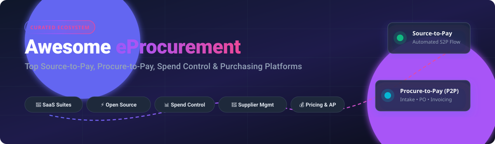

# 🛒 Awesome eProcurement Platform

<p align="center">
  
</p>

<p align="center">
  <a href="https://github.com/ishandutta2007/Awesome-Awesome-Awesome"></a>
  <a href="https://discord.gg/jc4xtF58Ve"></a>
  <a href="https://github.com/ishandutta2007/Awesome-Eprocurement-Platform/stargazers"></a>
  <a href="https://github.com/ishandutta2007/Awesome-Eprocurement-Platform/network/members"></a>
  <a href="https://github.com/ishandutta2007/Awesome-Eprocurement-Platform/issues"></a>
  <a href="https://github.com/ishandutta2007/Awesome-Eprocurement-Platform/blob/main/LICENSE"></a>
  <a href="https://github.com/ishandutta2007"></a>
</p>

---

## 🌟 Overview & Ecosystem Guide
Welcome to the curated ecosystem of **eProcurement Platforms**, **Source-to-Pay (S2P)** suites, and **Procure-to-Pay (P2P)** tools. This directory covers leading SaaS enterprise solutions and open-source self-hostable systems that streamline purchase requisitions, approval matrices, purchase orders (PO), AP invoice matching, vendor management, and spend analytics.

Whether you are seeking full spend visibility for mid-market purchasing or enterprise procurement automation, this guide breaks down process coverage, company valuations/revenue, transparent pricing tiers, and open-source GitHub projects.

---

## 📑 Table of Contents
- [🏢 SaaS & Hosted Platforms](#-saashosted-platforms)
- [💻 Open-Source GitHub Projects](#-open-source-github-projects)
- [🛠️ Procurement Architecture & Key Workflows](#️-procurement-architecture--key-workflows)
- [🤝 How to Contribute](#-how-to-contribute)
- [⭐ Star History](#-star-history)
- [⚖️ Disclaimer](#️-disclaimer)

---

## 🏢 SaaS/Hosted Platforms

*Ranked and sorted in descending order by company market capitalization, enterprise valuation, or annual revenue.*

| Platform | Company Scale / Valuation / Revenue | Description | Pricing (Starting Tier / Est.) | Free Tier / Trial Limits |
| :--- | :--- | :--- | :--- | :--- |
| **[Oracle Procurement Cloud](https://www.oracle.com/erp/procurement/)** | **~$400B+ Market Cap** (Oracle Corp, ~$53B+ Annual Revenue) | Part of Oracle Fusion Cloud ERP, delivering end-to-end source-to-settle processes tightly integrated with finance and supply chain. | Starts at ~$400–$650/hosted named user/month for specific cloud modules (or custom enterprise license agreement) | 30-day free trial via Oracle Cloud Free Tier ($300 cloud credits, subject to infrastructure services setup) or guided interactive tour. |
| **[SAP Ariba](https://www.sap.com/products/spend-management/ariba.html)** | **~$260B+ Market Cap** (SAP SE, ~$35B+ Annual Revenue; Ariba acquired for $4.3B) | Enterprise source-to-pay suite deeply integrated with the SAP ecosystem, offering sourcing, contracts, procurement, and one of the world's largest supplier networks. | Enterprise custom quote (starts at ~$80,000–$150,000/year for baseline deployments plus spend/document volume fees) | No free tier or trial for buyers (guided demo only); free standard account available for suppliers responding to RFQs/POs on Ariba Network. |
| **[Coupa](https://www.coupa.com/)** | **~$8B Acquisition / Enterprise Valuation** (by Thoma Bravo, ~$800M+ Annual Revenue) | Leading business spend management platform covering procurement, invoicing, expenses, and supplier collaboration with a large supplier network and AI analytics. | Enterprise custom quote (starts at ~$2,500/month / ~$30,000/year for core packages based on spend volume and modules) | No free tier or trial for core BSM platform (demo only); 30-day free trial available for Coupa Advanced Supplier Portal. |
| **[Zip](https://ziphq.com/)** | **~$2.2B Valuation** (Series D, ~$50M+ ARR) | Intake-to-procure platform that acts as a front door for employee requests, routing them through governed approval workflows into existing procurement and ERP systems. | Enterprise custom quote (starts at ~$40,000/year for intake workflows, scaling with user count, modules, and ERP connectors) | No free trial; custom sandbox demo upon sales qualification. |
| **[Jaggaer ONE](https://www.jaggaer.com/)** | **~$1.5B+ Valuation / Acquisition** (Acquired by Vista Equity Partners, ~$300M+ Revenue) | Comprehensive source-to-pay platform with strengths in direct materials, complex sourcing, bill of materials (BOM), and enterprise procurement. | Enterprise custom quote (modular annual subscription based on direct/indirect spend scope and user seats) | No free trial; customized solution walkthrough/demo available. |
| **[Ivalua](https://www.ivalua.com/)** | **~$1B+ Valuation** (Unicorn status, ~$180M+ ARR) | Unified source-to-pay suite handling direct and indirect spend, complex services procurement, and supplier lifecycle management. | Enterprise custom quote (tailored to enterprise scale, contract length, and module selection) | No free trial; tailored product demonstration available. |
| **[Basware](https://www.basware.com/)** | **~$700M Acquisition Valuation** (by Consortium led by Accel-KKR, ~$170M+ Revenue) | Global leader in procure-to-pay and e-invoicing, with deep automated accounts payable (AP) and cross-border regulatory compliance capabilities. | Enterprise custom quote (tiered based on annual e-invoice volume, P2P modules, and ERP integrations) | No free trial; interactive demo and business case assessment available. |
| **[GEP SMART](https://www.gep.com/software)** | **~$500M+ Annual Revenue** (Global privately held supply chain & procurement leader) | AI-driven unified procurement platform covering spend analysis, sourcing, contract management, and procure-to-pay. | Enterprise custom quote (annual contract based on spend under management and user licenses) | No free trial; tailored enterprise demo available (free supplier portal access for registered vendors). |
| **[Proactis](https://www.proactis.com/)** | **~$300M Acquisition Valuation** (Acquired by Pollen Street Capital, ~$60M+ Revenue) | Spend management and eProcurement solution widely used by public sector, healthcare, and mid-to-large commercial organizations. | Enterprise custom quote (annual subscription tailored to transaction volume, deployment scope, and modules) | No free trial; vendor-guided demo only. |
| **[Procurify](https://www.procurify.com/)** | **~$100M+ Estimated Valuation** (~$20M+ ARR, Series C funded) | Modern procurement platform focused on spend visibility, proactive approvals, and purchase order management for mid-market organizations. | Custom quote based on Pro licenses and modules (starts at ~$1,000/month / ~$12,000–$15,000/year billed annually; requester/Basic users included) | No free trial; interactive on-demand product tours and personalized live demo available. |
| **[Precoro](https://precoro.com/)** | **~$20M+ Estimated Valuation** (~$5M–$10M ARR) | Cloud procurement software for purchase orders, approvals, inventory, and spend control, popular with fast-growing companies. | **Core Plan**: Starts at $499/month (billed annually, includes core PO, PR, and approvals); **Automation Plan**: Starts at $999/month | 14-day free trial (full access to core features, no credit card required). |
| **[Tradogram](https://www.tradogram.com/)** | **~$5M–$10M Estimated Scale** (Bootstrapped / Early Stage SaaS) | Cloud purchasing and procurement management platform offering requisitions, multi-level PO approvals, supplier portals, and budgeting. | **Premium Plan**: Starts at $15/user/month (or custom quote for 20+ seats) | **Free Forever Plan**: 1 user, up to 10 transaction documents/month (POs/requisitions), basic dashboard, unlimited supplier/item records. |

---

## 💻 Open-Source GitHub Projects

*Ranked and sorted in descending order by GitHub Star count. Badges link directly to each repository's stargazers.*

1. **[Odoo](https://github.com/odoo/odoo)** [](https://github.com/odoo/odoo/stargazers) (Purchase & Procurement Apps – LGPL-3.0)  
   Modular open-source ERP whose Purchase application covers RFQs, purchase orders, vendor price-lists, automated replenishment, 3-way matching, and seamless integration with inventory and accounting.

2. **[ERPNext](https://github.com/frappe/erpnext)** [](https://github.com/frappe/erpnext/stargazers) (Buying & Sourcing Suite – GPL-3.0)  
   Fully open-source ERP with a mature procure-to-pay workflow: material requests, request for quotation (RFQ), supplier portal, purchase orders, multi-level approvals, supplier scorecards, landed costs, and automated reordering.

3. **[Apache OFBiz](https://github.com/apache/ofbiz-framework)** [](https://github.com/apache/ofbiz-framework/stargazers) (Enterprise Automation Suite – Apache-2.0)  
   Long-standing Apache top-level enterprise resource planning framework featuring complete purchasing, requisitioning, inventory, order processing, and supplier agreement modules.

4. **[metasfresh](https://github.com/metasfresh/metasfresh)** [](https://github.com/metasfresh/metasfresh/stargazers) (Open Source ERP – GPL-2.0 / GPL-3.0)  
   Responsive, cloud-ready open-source ERP tailored for high-volume order processing, supplier logistics, purchasing workflows, and automated invoice processing.

5. **[iDempiere](https://github.com/idempiere/idempiere)** [](https://github.com/idempiere/idempiere/stargazers) (Business Suite ERP/CRM/SCM – GPL-2.0)  
   Community-driven OSGi-based enterprise suite providing robust procurement management, RFQ handling, supplier rating, matching rules, and multi-currency accounting.

6. **[OpenProcurement](https://github.com/openprocurement)** [](https://github.com/openprocurement/openprocurement.api/stargazers) (Public & Commercial Tendering Toolkit – Apache-2.0)  
   High-transparency open-source eProcurement engine originally developed for Ukraine's national Prozorro system. Ideal for reverse auctions, public tendering, electronic bids, and compliant contract awards.

7. **[OpenBoxes](https://github.com/openboxes/openboxes)** [](https://github.com/openboxes/openboxes/stargazers) (Supply Chain & Inventory Management – Eclipse Public License)  
   Open-source supply chain and inventory management software providing requisition workflows, purchase order tracking, stock replenishment, and supplier fulfillment tracking.

8. **[Moqui Framework](https://github.com/moqui/moqui-framework)** [](https://github.com/moqui/moqui-framework/stargazers) (Enterprise Commerce & Procurement Engine – CC0-1.0)  
   Enterprise application ecosystem (incorporating HiveMind and Mantle Business Artifacts) featuring rich data models and services for procurement, purchasing, PO management, and supplier invoicing.

9. **[Flectra](https://github.com/flectra-hq/flectra)** [](https://github.com/flectra-hq/flectra/stargazers) (Open Source Business Suite – LGPL-3.0)  
   Open-source ERP and CRM with a dedicated purchasing module for vendor requests, purchase orders, bill approvals, and budgeting.

---

## 🛠️ Procurement Architecture & Key Workflows
Modern eProcurement solutions generally span five foundational lifecycle phases:

```
[ 1. Intake & Sourcing ] ➔ [ 2. Approval Matrix ] ➔ [ 3. Purchase Order ] ➔ [ 4. Receiving (GRN) ] ➔ [ 5. 3-Way Match & Pay ]
```

1. **Intake & Requisitioning**: Self-service catalogs and intake forms for employees to submit purchasing requests.
2. **Dynamic Approval Routing**: Multi-tiered rules based on department, cost center, spend amount, and category.
3. **Purchase Order Generation & Dispatch**: Automatic conversion of approved requisitions into vendor-ready POs with EDI/PDF transmission.
4. **Goods Receipt Note (GRN) & Inventory**: Documenting item intake, physical condition, and partial deliveries.
5. **2-Way & 3-Way Invoice Matching**: Automated verification across Purchase Order, Receipt (GRN), and Supplier Invoice before initiating ERP payment.

---

## 🤝 How to Contribute
1. 🍴 Fork the repository.
2. 📝 Add or update entries in `README.md` keeping the structured formatting and valid links.
3. 🔎 Ensure SaaS entries include pricing and trial details; Open-Source entries should include repository links and social star badges.
4. 🚀 Submit a Pull Request with a short explanation of your changes.

---

## ⭐ Star History
[](https://star-history.dera.page/#ishandutta2007/Awesome-Eprocurement-Platform&type=date&legend=top-left)

---

## ⚖️ Disclaimer
- This repository is a **community-curated** educational guide and index.
- All brand names, product logos, and registered trademarks belong to their respective corporate owners.
- Feature sets, pricing tiers, and licensing models may change over time; always refer to official vendor portals for binding quotations.